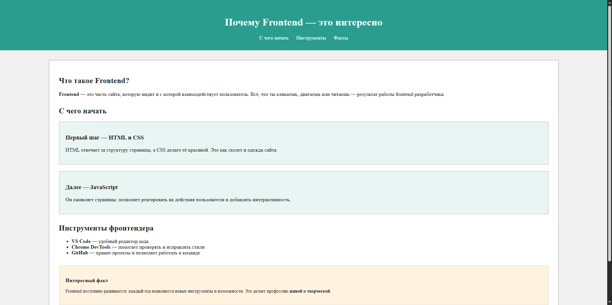
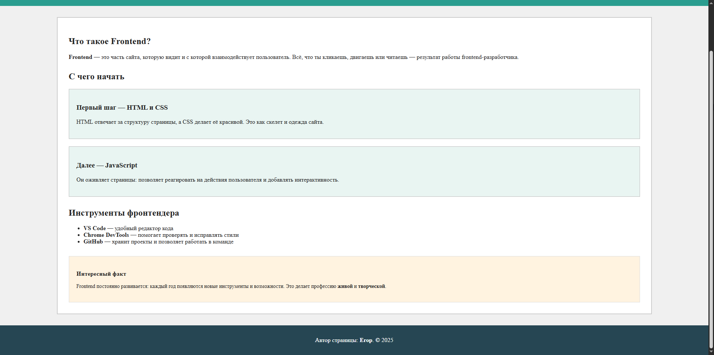

# Практика

Снизу приведены HTML код. Ваша задача написать CSS таким образом, чтобы получилось примерно, как на картинках.



и чуть не влезло



Цвета которые используются:
| Цвет | Где используется |
|:------|:-----------------------------|
| `#f0f0f0` | Фон всей страницы (`body`) |
| `#222` | Основной цвет текста |
| `#2a9d8f` | Фон шапки сайта (`.header`) |
| `white` | Текст в шапке и подвале, фон основного блока |
| `#ccc` | Рамка главного блока (`.main`) |
| `#e9f5f2` | Фон статей (`.article`) |
| `#bbb` | Рамка статей |
| `#fff3e0` | Фон бокового блока (`.aside`) |
| `#ddd` | Рамка бокового блока |
| `#264653` | Фон подвала (`.footer`) |

Структуру `html` кода менять нельзя.

```html
<!DOCTYPE html>
<html lang="ru">
<head>
  <meta charset="UTF-8">
  <meta name="viewport" content="width=device-width, initial-scale=1.0">
  <title>Почему Frontend — это интересно</title>
  <link rel="stylesheet" href="style.css">
</head>
<body>
  <header class="header">
    <h1>Почему Frontend — это интересно</h1>
    <nav>
      <a class="nav-link" href="#start">С чего начать</a>
      <a class="nav-link" href="#tools">Инструменты</a>
      <a class="nav-link" href="#facts">Факты</a>
    </nav>
  </header>

  <main class="main">
    <section class="section">
      <h2>Что такое Frontend?</h2>
      <p><b>Frontend</b> — это часть сайта, которую видит и с которой взаимодействует пользователь.  
      Всё, что ты кликаешь, двигаешь или читаешь — результат работы frontend-разработчика.</p>
    </section>

    <section class="section">
      <h2 id="start">С чего начать</h2>
      <article class="article">
        <h3>Первый шаг — HTML и CSS</h3>
        <p>HTML отвечает за структуру страницы, а CSS делает её красивой. Это как скелет и одежда сайта.</p>
      </article>
      <article class="article">
        <h3>Далее — JavaScript</h3>
        <p>Он оживляет страницы: позволяет реагировать на действия пользователя и добавлять интерактивность.</p>
      </article>
    </section>

    <section class="section" id="tools">
      <h2>Инструменты фронтендера</h2>
      <ul>
        <li><b>VS Code</b> — удобный редактор кода</li>
        <li><b>Chrome DevTools</b> — помогает проверять и исправлять стили</li>
        <li><b>GitHub</b> — хранит проекты и позволяет работать в команде</li>
      </ul>
    </section>

    <aside class="aside" id="facts">
      <h3>Интересный факт</h3>
      <p>Frontend постоянно развивается: каждый год появляются новые инструменты и возможности.  
      Это делает профессию <b>живой</b> и <b>творческой</b>.</p>
    </aside>
  </main>

  <footer class="footer">
    <p>Автор страницы: <b>Егор</b>. © 2025</p>
  </footer>

</body>
</html>
```
