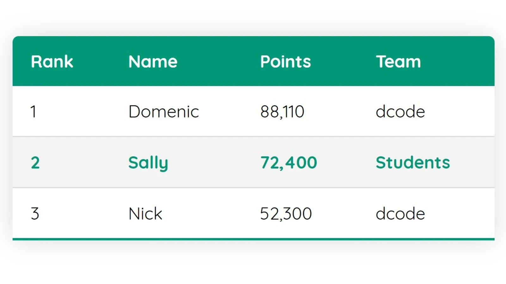

# Теория

- [HTML таблицы основы](https://developer.mozilla.org/ru/docs/Learn/HTML/Tables/Basics)
- [HTML таблицы продвинутые](https://developer.mozilla.org/ru/docs/Learn/HTML/Tables/Advanced)
- [Таблицы](https://doka.guide/html/tables/)
- [background-color](https://doka.guide/css/background-color/)
- [background-image](https://doka.guide/css/background-image/)
- [background-position](https://doka.guide/css/background-position/)
- [background-repeat](https://doka.guide/css/background-repeat/)
- [background-size](https://doka.guide/css/background-size/)
- [background-attachment](https://doka.guide/css/background-attachment/)
- [background-clip](https://doka.guide/css/background-clip/)
- [background-origin](https://doka.guide/css/background-origin/)
- [flow](https://doka.guide/html/flow/)
- [normal flow](https://developer.mozilla.org/ru/docs/Learn/CSS/CSS_layout/Normal_Flow)
- [display](https://doka.guide/css/display/)
- [border](https://doka.guide/css/border/)

# Практика

## Задача 1

---

## Задача 2

---

## Задача 3

---

## Задача 4

## Задача 5

