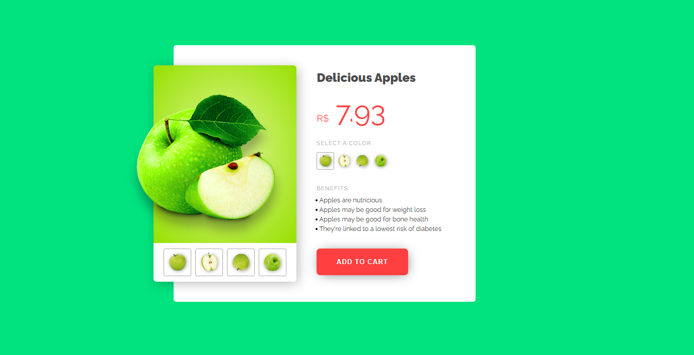
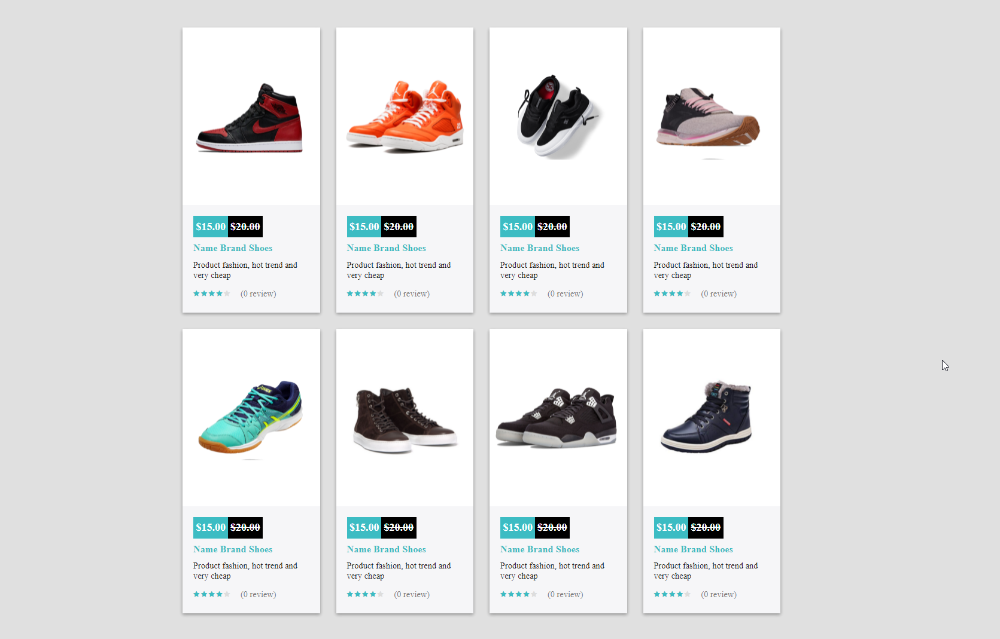
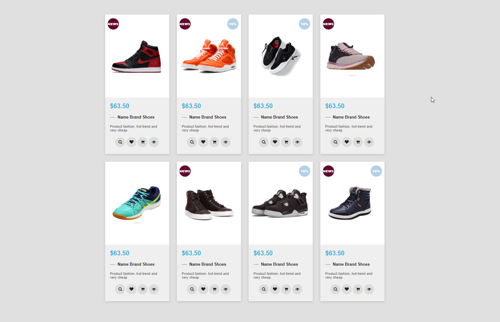
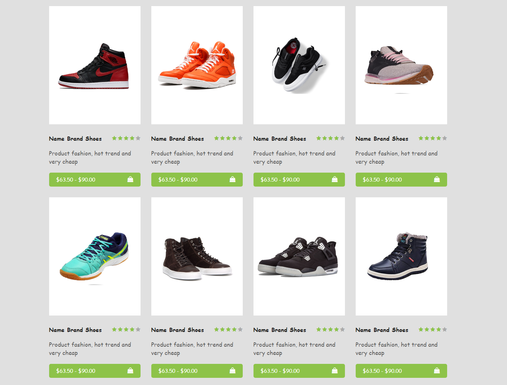
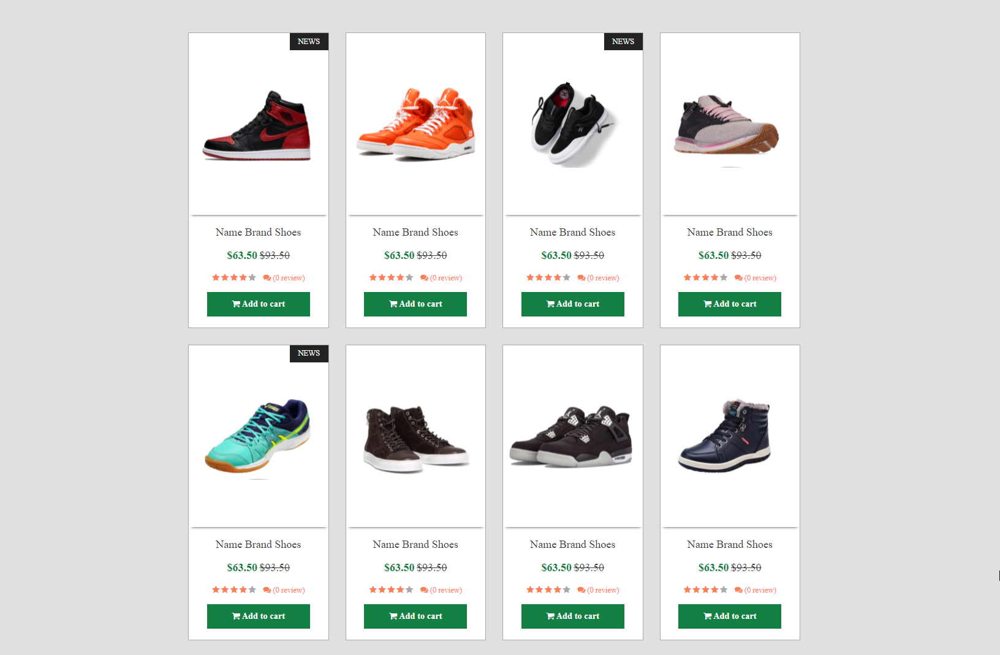

# Теория

- [Селектор по тегу](https://doka.guide/css/tag-selector/)
- [Селектор по классу](https://doka.guide/css/class-selector/)
- [Селектор по идентификатору](https://doka.guide/css/id-selector/)
- [Селектор потомка](https://doka.guide/css/nesting-selector/)
- [Универсальный селектор](https://doka.guide/css/universal-selector/)
- [Селектор по атрибуту](https://doka.guide/css/attribute-selector/)
- [Комбинированные селекторы](https://doka.guide/css/combined-selectors/)
- [Перечисление селекторов](https://doka.guide/css/selector-list/)
- [Универсальные селекторы](https://developer.mozilla.org/ru/docs/Web/CSS/Universal_selectors)
- [Селектор дочерних элементов](https://developer.mozilla.org/ru/docs/Web/CSS/Child_combinator)
- [Селектор следующего элемента](https://developer.mozilla.org/ru/docs/Web/CSS/General_sibling_combinator)
- [Смежные селекторы](https://developer.mozilla.org/ru/docs/Web/CSS/Adjacent_sibling_combinator)
- [Float](https://developer.mozilla.org/ru/docs/Learn/CSS/CSS_layout/Floats)
- [Позиционирование](https://developer.mozilla.org/ru/docs/Learn/CSS/CSS_layout/Positioning)
- [overflow](https://doka.guide/css/overflow/)
- [box-shadow](https://doka.guide/css/box-shadow/)

# Практика

# Задача 1

Ресурсы картинок

- [1](./img/position/apple-top.png)
- [2](./img/position/green-apple-flipped.png)
- [3](./img/position/green-apple-with-slice.png)
- [4](./img/position/green-apple2.png)
- [5](./img/position/half-apple.png)

Сверстать

# Задача 2

Нужно сверстать все 4 шаблона каталога товаров

> Шрифты найдите похожие на [google fonts](https://fonts.google.com)

Картинки продуктов:

- [1](./img/shoes/1.png)
- [2](./img/shoes/2.png)
- [3](./img/shoes/3.png)
- [4](./img/shoes/4.png)
- [5](./img/shoes/5.png)
- [6](./img/shoes/6.png)
- [7](./img/shoes/7.png)
- [8](./img/shoes/8.png)

Шаблоны

## 1

## 2

## 3

## 4

