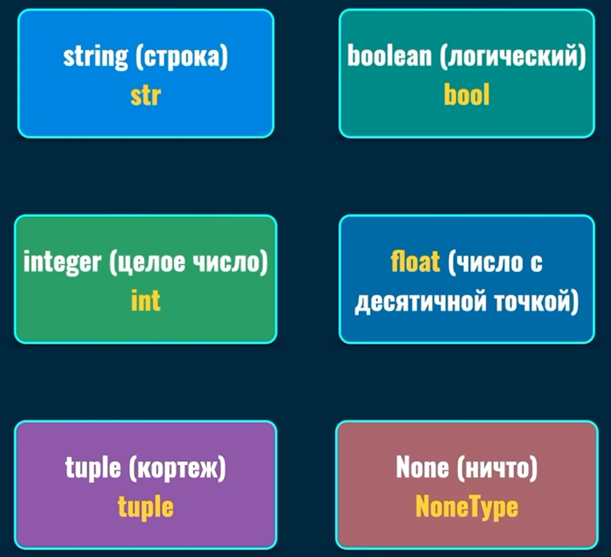

# Python введение

Python — это язык программирования, который широко используется в интернет-приложениях, разработке программного обеспечения, науке о данных и машинном обучении.

# Настройка Python на компьютере

1) Проверить, установлен ли на данный момент python. Сделать это можно в powershell
``` cmd
python --version
```

Если у вас не вывело `Python 3.11.1` или другую версию, то вам необходимо [установить](https://www.python.org/downloads/) Python на свой компьютер.

При установке рекомендуется поставить галочку на пункте `Add python.exe to PATH`

После этого снова повторить команду и убедиться, что у вас появился python и его версия.
``` cmd
python --version
```

2) Открываем Visual Studio Code и нам необходимо скачать дополнительные расширения для выполнения файлов с расширением `.py`.

Расширение `Python`

Расширение `Code Runner`

> Если хотите, можете использовать следующие настройки VS Code.
> Code-runner: Save File Before Run. Если поставите галочку, будет сохранять файл при запуске интерпритатора.
> Code-runner: Show Execution Message. Если поставите галочку, будет скрывать сообщения при выводе [Running] и [Done].
> Code-runner: Clear Previous Output. Если поставите галочку, будет каждый раз очищать поле вывода при следующем запуске.
> format on save. Если поставите галочку, будет форматировать ваш код по умолчанию, в спецификации PEP8.

Теперь справа вверху появилась стрелочка, которая называется `Run Code`. Именно с помощью этой кнопки мы будем исполнять файлы python.

# Главная идея Python

Python - объектно-ориентированный язык программирования.

Все сущности в Python - объекты.

Объект - это экземпляр класса.

Класс - это шаблон или прототип для создания объектов. На основании одного класса можно создавать много разных объектов.

У каждого объекта есть атрибуты. Атрибут объекта называется `методом` если его значение `функция`. Метод можно вызывать, как и функцию.

# Основные типы данных

`Переменная` хранит данные одного из типов данных. В Python существует множество различных типов данных. В данном случае рассмотрим только самые базовые типы: `str`, `int`, `float`, `bool`, `list` и словари `dict`.

## Переменные

Переменные предназначены для хранения данных. Название переменной в Python должно начинаться с алфавитного символа или со знака подчеркивания и может содержать алфавитно-цифровые символы и знак подчеркивания.

Для создания переменных используется следующая структура:
```python
название_переменной = значение_переменной

name = 'Egor'
name = 'Tom' #  Динамическая типизация
age = 22
```
### Ниже приведены некоторые неизменяемые объекты



>Переменные ссылаются на область в памяти. Проверить это можно с помощью встроенной функции id().

> Следует называть переменные таким образом, чтобы вы понимали, что они в себе хранят.
> 
> Если назвать переменную нужно из двух и более слов используется:
> 
> 1) сamelCase - каждое новое подслово в наименовании переменной начинается с большой буквы. 
>
> ```python
>userName = "Tom"
>```
> 
> 2) Underscore notation - подслова в наименовании переменной разделяются знаком подчеркивания.
>
> ```python
>user_name = "Tom"
>```


## Строки 

Тип `str` представляет строки. Строка представляет последовательность символов, заключенную в одинарные или двойные кавычки, например "hello" и 'hello'. В Python 3.x строки представляют набор символов в кодировке Unicode.

``` python
str 'Tom'
str "Jarry"
```

## Целые числа

Тип `int` представляет целое число, например, 1, 4, 8, 50. Пример

```python
int 15
int -30
```

## Дробные числа

Тип `float` представляет число с плавающей точкой, например, 1.2 или 34.76. В качесте разделителя целой и дробной частей используется точка.
```print
float 35.2
```

## Логические значения

Тип `bool` представляет два логических значения: `True` (верно, истина) или `False` (неверно, ложь). Значение `True` служит для того, чтобы показать, что что-то истинно. Тогда как значение `False`, наоборот, показывает, что что-то ложно. Пример переменных данного типа:

```python
bool True
bool False
```

## Списки

Список (`list`) представляет тип данных, который хранит набор или последовательность элементов. Во многих языках программирования есть аналогичная структура данных, которая называется массив.
Для создания списка применяются квадратные скобки [ ], внутри которых через запятую перечисляются элементы списка.

```python
list [1,2,3]
```

## Словари

Словарь (`dictionary`) в языке Python хранит коллекцию элементов, где каждый элемент имеет уникальный ключ и ассоциированое с ним некоторое значение.

```python
dict {'min': 5, 'max' : 8}
```

## Встроенные функции

```python
print('Hello world')
```

`print` является встроенной функцией.

Круглые скобки вызывают функцию.

Внутри круглых скобок указывается то, что мы хотим вывести в терминал. Сейчас это значение типа str. Также это называют `аргументом` функции.

> Для понимания работы функций рассмотрим пример. Для дальнейшего понимания мы вернёмся к функциям позже.
> ```python
>def myFunction(a,b):
>    a = a + 1
>    c = a + b
>    return c
>```
> Здесь `def` объявляет функцию, с именем `myFunction`. В круглые скобки передаются `параметры` (аргументы) функции. Три последующие строки являются телом функции, где выполняется некоторый набор действий и в конце следует `return`, он позволяет вернуть какое-то значение как результат выполнения функции.

Встроенных функций очень много, они сами выполняют некоторый набор действий, что облегчает написание кода. Покажу лишь несколько примеров встроенных функций:

```python
print()
len()
round()
int()
type()
sum()
min()
str()
max()
bool()
input()
```

Встроенная функция `input` позволяет запросить у пользователя определённые данные в терминале. Вызываем функцию `input`. Ей передаём строку в качестве аргумента. Эту строку пользователь увидит в терминале и когда код дойдёт до этой строки, программа остановится и будет ждать ввода от пользователя и нажатия Enter. 

> Всегда, после ввода в input результатом будет тип `str` (строка).

```python
name = input('Enter your name: ')
print(name)
```
## Функция dir и атрибуты объектов

```python
name = 'Egor'
print(dir(name))
```
Встроенная функция `dir` позволяет получить названия всех артибутов какого-то объекта. Вспоминаем, что у каждого объекта есть атрибуты, которые являются методами. `dir` показывает возможные атрибуты. Эти методы были созданы для класса, из которого была создана строка.

## Использование методов для объектов с помощью `.`

```python
name = 'Egor'
print(name.upper())
```

`.upper()` вызывает метод upper у строки name.

### Попробуем поработать с функцией print, input и методами строк.

```python
input('Enter your name: ')
```

Сейчас мы не добавили вывод и полученный от ввода результат нигде не сохранился. Исправим это, добавив переменную и вывод этой переменной.

```python
name = input('Enter your name: ')

print(name)
```

Code Runner только выводит результат выполнения кода. Из-за этого мы не можем использовать в его выполнении `input`. 

Попробуем запустить код через интерпритатор python. Останавливаем Code Runner и открываем терминал. Убеждаемся, что мы находимся в нужной папке и можем проверить все файлы, что находятся внутри с помощью команды `ls`. Там отображается `имя_файла.py`

Для того, чтобы выполнить файл, нам нужно вызвать файл. В моём случае файл называется `main.py`.

```cmd
python main.py
```

Чтобы немного освоить методы строк, стоит попробовать усовершенствовать программу.

```python
name = input('Enter your name: ')

print(dir(name))
```

Так мы выведем все возможные методы. Попробуем один из них, `capitalize`.

```python
name = input('Enter your name: ')

print(name.capitalize())
```

И снова запускаем через интерпритатор кода python.

# Форматирование кода

### Отступы 

Отступы играют важную роль, они позволяют показать вложенность каких-то строк кода в другие. Это будет встречаться постоянно, так что лучше это понять сразу. Обычно отступы занимают 4 пробела, но нет смысла самому ставить пробелы, ведь можно поставить табуляцию с помощью кнопки `Tab` на клавиатуре.

Пример правильных отступов:

```python
def my_name(name):
    print(name)

my_name('Egor')
```

Пример неправильных отступов:
```python
def my_name(name):
print(name)

my_name('Egor')
```

Про правильность и красоту оформления кода можно почитать [тут](https://peps.python.org/pep-0008/)

Если хотите чтобы код отформатировался по стандарту PEP8, вам необходимо нажать `Ctrl` + `Shift` + `P`. В появившемся окне написать `Format Document With` далее выбрать `Python` и справа внизу предложат установить расширение. Нажимаем `Yes`. И повторяем форматирование документа.

Если хотите сделать автоформатирование при сохранении:

Заходим в настройки и пишем `format on save`. Ставим галочку, если вам это нужно.

## Комментарии

Комментарии игнорируются интерпритатором.

Комментарии нужны для того, чтобы оставить для себя какое-то напоминание в коде или оставить для других разработчиков.

Также, если какая-то часть кода ломается и нужно проверить выполнение без какой-то части кода, удобно её комментировать. Интерпритатор при этом не будет воспринимать этот код.

```python
# Это комментарий

# Многострочный
# комментарий

print(5)  # Код с комментарием
```

---

## Выражение (expressions)

Результатом выражения является `значение`.

```python
print(5+3)  # 8 - Сумма выражений
print(a > b) #  True или False
print('Hello' + 'World')  # 'Hello World'
my_func(10, 5)  # результат функции
```

## Инструкции (statements)

Инструкция выполняет действие. Запускает функцию, цикл и т.д..

```python
my_name = 'Egor'  # Присвоение значения

# Условная инструкция
if(my_name):
    print(my_name)

# Испортирование модуля
import datetime
```

# Строки

Строка - последовательность символов.

При создании строки создаётся объект типа строка с экземпляром класса `str`. Мы можем это увидеть, если поместим строку в встроенную функцию `type()`:

```python
my_name = 'Tom'
print(type(my_name))  # <class 'str'>
```

## Структура и синтаксис

```python
my_name = 'Tom'
print(my_name)
```

```python
my_name = "Tom"
print(my_name)
```

> Придерживайтесь одного стиля написания кавычек.

Для написания многострочных строк мы помещаем текст в тройные одинарные кавычки, либо в тройные двойные кавычки:

```python
message = '''Congratulations,
you are learning the Python
programming language.'''
print(message)
# Congratulations,
# you are learning the Python
# programming language.
```

## Встроенные функции и строки

len() принимает в себя объект и возвращает длину строки.

```python
my_name = 'Tom'
print(len(my_name))
# 3
```

Строка - это последовательность символов, следовательно мы можем обращаться к отдельным символам строки. Синтаксически это выглядит так, `переменная[номер_символа]`

> Индексация начинается с 0

```python
my_name = 'Tom'
print(my_name[0])
# T
```

С помощью этого синтаксиса можно вернуть диапазон символов. Включая символ первого введённого индекса и не включая второго введённого индекса:

```python
my_name = 'Tom'
print(my_name[1:3])
# om
```

Также можно использовать такую запись, когда вернётся строка начиная с первого индекса и до конца строки. Наоборот работает противоположно.

```python
my_message = 'Lorem ipsum'
print(my_name[3:])
# em ipsum
print(my_name[:3])
# Lor
```

## Методы строк

В домашнем задании есть ссылка на статьи с методами и примерами к ним.  

Для того чтобы посмотреть доступные методы для объекта используется встроенная функция dir():

```python
my_name = 'Tom'
print(dir(my_name))
# Список методов
```

Методы вызываются с помощью точечной записи:

```python
my_name = 'Tom'
print(my_name.upper())
# TOM
print(my_name.lower())
# tom
print(my_name.index('o'))
# 1
print(my_name.replace('m', 'p'))
# Top
```

> Важно! Методы не изменяют строки. Если вам нужно в эту же переменную положить новое значение, то используется такой синтаксис:

```python
my_str = 'Lorem ipsum'
print(my_str.replace('Lorem', 'Dollar'))
print(my_str)
# Вывод: Lorem ipsum
# Изменение в переменной my_str не произошло

my_str = my_str.replace('Lorem', 'Dollar')
print(my_str)
# Вывод: Dollar ipsum
# Изменение в переменной my_str произошло
```

Также мы можем использовать цепочку методов:
```python
name = 'Tirion'
print(name[1:5].upper().find('I'))
# 0
```

Можно использовать отрицательный индекс при работе со строкой, в таком случае идут символы справа налево начиная с -1:

```python
my_name = 'Lorem ipsum'
print(my_name[-1])
# m
print(my_name[-4])
# p
```


# Условный оператор `if`

## Синтаксис

Синтаксис для простого условия:

```python
if(условие):
    блок команд выполняется, если условие верно

# Если условие было верным, выполняется блок команд после if
# Если условие было ложным, то блок if просто пропустится
```

Синтаксис для сложного условия:

```python
if(условие):
    блок команд выполняется, если условие верно
else:
    блок команд, которые выполняются, если условие не верно

# Если условие было верным, выполняется блок команд после if
# Сейчас, если условие будет ложным, то будут выполняться условие внутри блока else
```

В if написано условие, которое проверяется на истиность или ложность. Существуют только правда или ложь для условий. В случае, если условие было верно, пойдёт выполнение команд, которые находятся сразу после if. Если условие ложно - происходит выполнение команд в блоке else.

> В if используются 3 слова:
> 
> `and` - означает `И`
> 
> `or` - означает `ИЛИ`
> 
> `not` - означает `НЕ`

Живой пример:

```python
my_str = 'lorem ipsum'

if(len(my_str) != 0):
    print('Stroka ne pystaya')
else:
    print('Stroka pystaya')

# Stroka ne pystaya
```

Условный оператор if проверяет некоторое условие на истинность. В примере выше была проверка на то, пуста ли строка. Встроенная функция len возвращала длину строки, после эта длина сравнивается с 0. `Как результат выполнения условия мы всегда получаем ПРАВДУ или ЛОЖЬ`. На основе этого оператор if начинает выполнять тот или иной блок кода.

---

## Составные условия

Для того, чтобы работать с более сложными условиями мы можем делать несколько условий внутри одного if. Делается это с помощью служебных слов `or` и `and`.

Например, нам нужно проверить, является ли число чётным `И` больше 10. 

> В этой задаче требуется узнать сразу два условия, оба из которых обязательно должны быть правдой. Если мы используем оператор `and`, мы получим правду только тогда, когда оба условия верны.

```python
my_num = 16

if(my_num % 2 == 0 and my_num > 10):
    print('true')
else:
    print('false')

# true
# Измените значение my_num и посмотрите результаты
```

Рассмотрим другую задачу

Дана строка, если первый символ в строке равен 'l' `ИЛИ` 'L', то выводит true. В противоположном случае - вывести false.

> В этой задаче правдивым будет вариант, если хотя бы одно из условий верно. Для этого помогает оператор `or`, которому достаточно хотя бы одного верного условия для получения в истины в условии.

```python
my_str  = 'lorem ipsum'

if(my_str[0] == 'l' or my_str[0] == 'q'):
    print('true')
else:
    print('false')

# true
# Измените значение в my_str и посмотрите результаты
```

---

## Вложенные условия

Также, бывают моменты, когда вам может быть нужно вложить условия внутрь других условий, тем самым простраивая целую цепочку логических выражений.

Синтаксис

```python
if (условие):
    блок команд, если первое условие было верно
    if(условие):
        блок команд, если первое и второе условие было верным
    else:
        блок команд, если первое условие было верно, а второе ложно
else:
    Блок команд, которые выполняются, если первое условие дало ложь
    if(условие):
        блок команд, которые выполняются, если первое условие ложь, а это условие верно
```

Вся логика начинается с первого условия и проверяется, было ли верно первое условие, дальше от правдивости выражения программа идёт по тому или иному пути.

Также существует более короткая запись, если нам нужно написать 
```python
if():
    print()
else:
    if():
        print()
    else:
        print()
```

Мы можем заменить эту запись на такую. В этом примере меняется только написание else и if. В случае, когда условие ложно и нам сразу нужно проверить ещё одно условие, мы можем совместить else if в `elif`. Запись становится чище и пропадает большая вложенность.

```python
if():
    print()
elif():
    print()
else:
    print()
