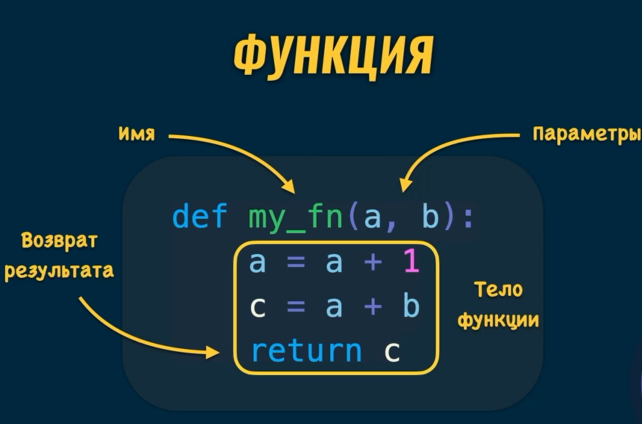

# Диапазоны `range`

Диапазон - упорядоченная неизменяемая последовательность элементов

Диапазоны обычно используются в циклах

## Стурктура и синтаксис

```python
my_range = range(7)

print(type(my_range))
# <class 'range'>

print(my_range)
# range(0, 7)

print(list(my_range))
# [0, 1, 2, 3, 4, 5, 6]
```

С помощью встроенной функции `range` мы передаём целое число 7 и результат этой функции мы присваиваем значению `my_range`. Наследуя класс `range`.

Если вывести сам диапазон, то мы увидим от чего до чего он идёт. В нашем примере от 0 до 7 НЕ включительно.

Для большей наглядности приобразуем в список и выведем его. Это последовательность элементов начинающаяся с 0 и заканчивающаяся 6 (потому что 7 не включается).

## Добавление шага в диапазонах

При необходимости мы можем указывать начальное значение, конечное и шаг с которым будет создаваться диапазон.

```python
my_range = range(10, 20, 3)

print(my_range)
# range(10,20, 3)

print(list(my_range))
# [10, 13, 16, 19]
```

Так в нашем примере 10 начальное значение, 20 конечное, а 3 это шаг, с которым идёт диапазон.


## Индексы элементов в диапазонах

```python
my_range = range(10, 20, 3)

print(my_range[0]) # 10
print(my_range[1]) # 13
print(my_range[2]) # 16
print(my_range[3]) # 19
print(my_range[4])

# IndexError: range object index out of range
```

В случае, если нам нужно обратиться к какому-то элементу в последовательности - мы можем это сделать через квадратные скобки и указать его индекс. В случае, если такого индекса не существует - мы получаем ошибку.

## Использование диапазонов в циклах

```python
for n in range(10, 20, 3):
    print(n)
    #10
    #13
    #16
    #19
```

# Последовательности: сравнение типов

|       | Изменения | Порядок | Одинаковые элементы |
|:-------:|:-----------:|:---------:|:---------------------:|
| list  |     ✔     |    ✔    |          ✔         |
| tuple |     ❌     |    ✔    |          ✔        |
| set   |     ✔     |    ❌    |          ❌         |
| range |      ❌    |    ✔    |          ❌         |
| dict  |     ✔     |    ❌    |          ❌         |
| str   |     ❌     |    ✔    |          ✔         |


# Встроенная функция `zip`

Встроенная функция zip позволяет формировать новые объекты на основании других последовательностей. Т. е. объекдинять последовательности вместе.

```python
fruits = ['apple', 'banana', 'lime']

qty = [100, 70, 50]

fruit_qty_zip = zip(fruits, qty)

print(fruit_qty_zip)
# <zip object at 0x000001A5F5A3E1C0>

fruit_qty_list = list(fruit_qty_zip)

print(fruit_qty_list)
# [('apple', 100), ('banana', 70), ('lime', 50)]
```

Если мы преобразуем zip в list, мы получим список кортежей, которые получились из объекдинения двух последовательностей.

Если одна из начальных последовательностей будет больше по длине чем вторая, то "лишняя" часть не попадёт в объект zip.

При вызове функции zip мы можем добавлять несколько последовательностей, например

```python
fruits = ['apple', 'banana', 'lime']

qty = [100, 70, 50]

availability = [True, False, False, True]

fruit_qty_zip = zip(fruits, qty, availability)

print(fruit_qty_zip)
# <zip object at 0x000001A5F5A3E1C0>

fruit_qty_list = list(fruit_qty_zip)

print(fruit_qty_list)
# [('apple', 100, True), ('banana', 70, False), ('lime', 50, False)]
```

## Конвртация `zip` в `dict`

```python
fruits = ['apple', 'banana', 'lime']

qty = [100, 70, 50]

fruit_qty_zip = zip(fruits, qty)

print(fruit_qty_zip)
# <zip object at 0x000001A5F5A3E1C0>

fruit_qty_list = dict(fruit_qty_zip)

print(fruit_qty_list)
# {'apple': 100, 'banana': 70, 'lime': 50}
```

Если мы попытаемся добавить более двух последовательностей перед конвертацией в dict, то мы увидим ошибку, которая сообщает о том, что словарь не понимает как совмещать столько последовательностей.

---

# Функции

Функция - блок кода, который можно выполнять многократно. При чём, с разными входными данными. 

Рассмотрим такой пример:
```python
a = 5
b = 3

c = a + b
print(c) # 8

a = 8
b = 12

c = a + b
print(c) # 20
```

Здесь у нас дважды высчитывается `c` при разных значениях `a` и `b`. 

Для удобства и облегчения кода создаются функции. С ними код будет выглядеть так:

```python
def sum (a,b):
    c = a + b
    print(c)

a = 5
b = 3

sum(a, b) # 8

a = 8
b = 12

sum(a, b) # 20
```

Функция создаётся с помощью слова `def`, далее идёт название функции `sum`. В круглых скобках мы передаём входные данные, если они нажны. В нашем случае это `a` и `b`. Далее после знака `:` находится тело функции. Оно табулировано. Именно это тело функции и будет выполняться при каждом вызове функции.

Для того, чтобы функция начала работать, нам необходимо её вызвать. Делается это с помощью запиши `sum(a, b)`. Пишем название переменной, круглые скобки и внутри параметры, которые нам нужны.

## Функция - это объект

Каждая функция это экземпляр класса function.

```python
def sum(a, b):
    c = a + b
    print(c)

print(type(sum))
# <class 'function'>
```



Параметры можно рассматривать как переменные, которые доступны только внутри функции. Значение этих параметров внутри функции можно изменять. А начальные параметры функции определяются в момент вызова функции.

Возврат значения из функции осуществляется с помощью слова `return`. Однако, слово return опционально. Когда программа дошла до слова return, работа функции завершается, даже если ниже есть код.

Функция возвращает `None` если нет ключевого слова `return`

Функцию нужно вызвать для выполнения кода внутри функции

## Вызов функции

```python
def my_fn(a, b):
    a = a + 1
    c = a + b
    return c

res = my_fn(10,3)
print(res) # 14
```

В вызове функции как параметры добавлены 10 и 3. Они попадают в параметры функции.
В параметр `a` попадает значение 10, а в параметр `b` попадает значение 3.

И именно с этими данными функция начнёт работать. 

Из-за того что внутри фунции есть слово `return`, нам вернётся значение, которое будет помещено в переменную `res`.

## Самая короткая функция

```python
def me_fn():
    pass

print(my_fn()) # None
```

## Передача неизменяемых объектов

```python
def my_fn(a, b):
    a = a + 1
    c = a + b
    return c

num_one = 10
num_two = 5

res = my_fn(num_one, num_two)
print(res) # 16
print(num_one) # 10
```

После изменения значения num_one внутри функции (a = a + 1), значение num_one не изменилось.

## Передача изменяемых объектов

```python
def inc_pers_age(person):
    person['age'] += 1
    return person

person_one = {
    'name': 'Bob',
    'age': 21
}

inc_pers_age(person_one)
print(person_one['age']) # 22
```

При передаче изменяемых объектов мы изменяем также и внешние переменные. В данном примере мы изменили `person_one['age']`.

---

Внутри функции не рекомендуется изменять внешние объекты

---

## Избежание изменения изменяемых объектов

### Создание копии объекта

```python
def inc_pers_age(person):
    person_copy = person.copy()
    person_copy['age'] += 1
    return person_copy

person_one = {
    'name': 'Bob',
    'age': 21
}

new_person = inc_pers_age(person_one)
print(new_person['age']) # 22
print(person_one['age']) # 21
```
